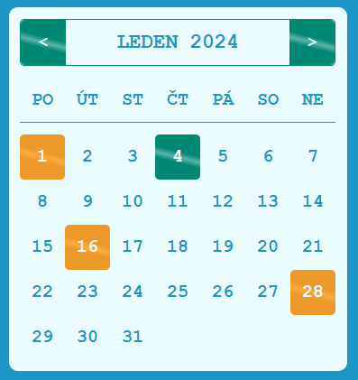
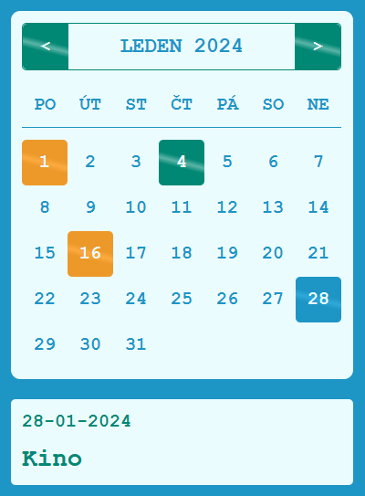

# 📆 Calendar in PHP

**What the project do?**
1) You can click between months to see days for different months
2) Today's day is displaying in green color
3) Days with events are displaying in orange color (event is showing when th day is hover)

## 🛠️ Technologies
PHP and LESS

## 🖥️ Preview

